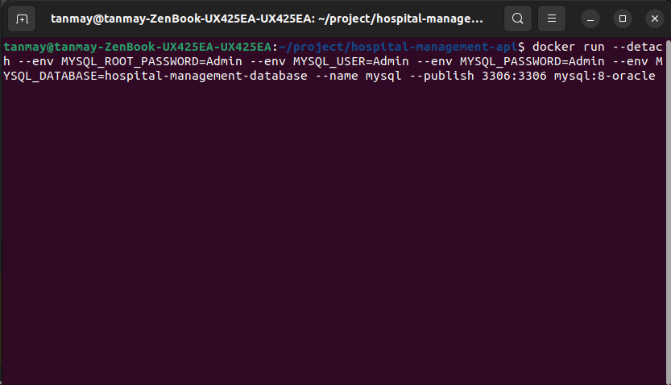

## Hospital Management Application

### Follow the following steps to run the application 

1. Step 1 -> Install docker (I have used docker to launch MySQL image to perform CRUD operations)
   
3. Step 2 -> Run this command to install and launch my SQL container
   `docker run --detach --env MYSQL_ROOT_PASSWORD=Admin --env MYSQL_USER=Admin --env MYSQL_PASSWORD=Admin --env MYSQL_DATABASE=hospital-management-database --name mysql --publish 3306:3306 mysql:8-oracle`
   Addtional you can tweak changes in the application.properties to connect to different databases I have mentioned it there
   

   
5. Step 3 -> Launch Spring boot application(Backend)
   `cd hospital-management-api`
   `mvn spring-boot:run`
   or
   `java -jar target/hospital-management-api-0.0.1-SNAPSHOT.jar`
   or
   you can run the project using the IDE
6. Step 4 -> Launch React Application (Frontend)
   `cd hospital-management-frontend/frontend-react`
   `npm start`
